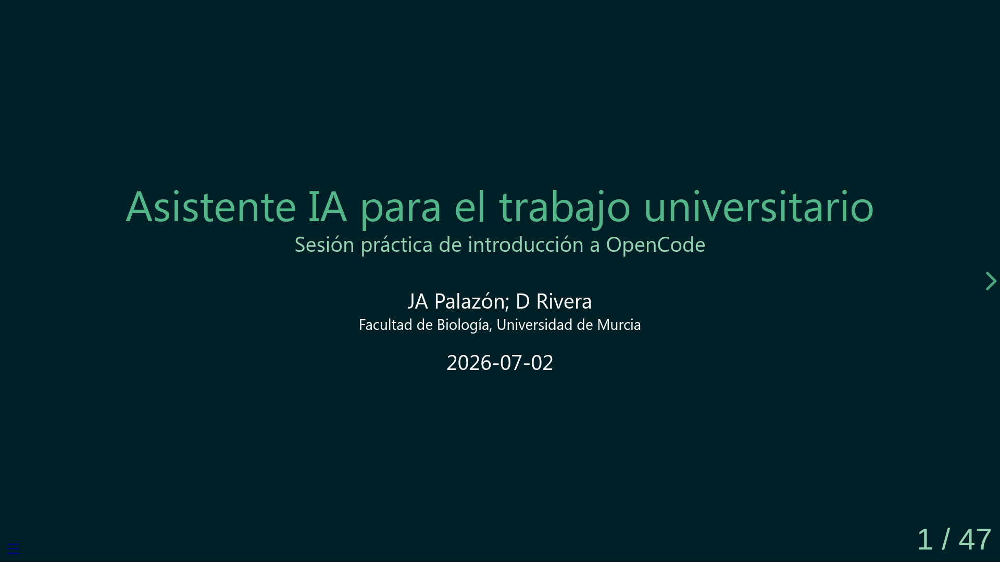

# Asistente IA para el trabajo universitario

  

  <em>Haz clic en la imagen para abrir la presentación</em>

Materiales del taller impartido en la Facultad de Biología de la Universidad de Murcia.

**Versión:** 1.0 · **Licencia:** CC BY-NC-SA 4.0

> **[Versión navegable de todos los materiales](https://palazon.github.io/ocCursoDivulga/)** — Accede directamente a la presentación, documentos y glosario desde el navegador.

## Recursos principales

- **[Presentación del taller](https://palazon.github.io/ocCursoDivulga/100-oc-divulga.html)** — Diapositivas autocontenidas con ejemplos, ejercicios y referencias. Se abre directamente en el navegador.
- **[Vídeo de la sesión](https://umurcia.zoom.us/rec/play/ta3zzdOjkFywo35Vv7wnFcdCrcN9RDUWLQMlHe7XisW5Rnngz-crhdENH_zNkkzCWIkwoxmZPVppYldd.RBA5dxmy19eX7_wq?accessLevel=meeting&canPlayFromShare=true&from=share_recording_detail&continueMode=true&oldStyle=true&componentName=rec-play&originRequestUrl=https%3A%2F%2Fumurcia.zoom.us%2Frec%2Fshare%2FYKZsu4UUeSnneT9xbQyFCPgkImjaFQqMxLQRyeQXsDsFGurxpD9E7fZjkoxVkavK.1wf4sZyQa88k4NH0)** — Grabación de la sesión explicativa en Zoom.

## Documentos de apoyo

- **[Del modelo de aplicaciones al de texto plano](https://palazon.github.io/ocCursoDivulga/docs/bases-cambio-modelo.html)** — Ensayo que explica por qué conviene pasar de apps a documentos de texto con asistentes de IA.
- **[Diagnóstico del perfil de usuario](https://palazon.github.io/ocCursoDivulga/docs/diagnostico-usuario.html)** — Describe las dificultades habituales del personal universitario con la tecnología.
- **[Preguntas frecuentes](https://palazon.github.io/ocCursoDivulga/docs/faq-cambio-modelo.html)** — Respuestas a las dudas más comunes sobre el cambio de modelo de trabajo.
- **[Glosario](https://palazon.github.io/ocCursoDivulga/docs/glosario.html)** — Definición de los términos técnicos.
- **[Análisis de plantilla ineficiente](https://palazon.github.io/ocCursoDivulga/docs/analisis-plantilla-ineficiente.html)** — Caso real de una plantilla Word con problemas de diseño.
- **[Análisis de plantillas universitarias](https://palazon.github.io/ocCursoDivulga/docs/analisis-plantillas-universitarias.html)** — Comparativa de diez documentos universitarios con datos cuantitativos.

## Estructura de la sesión

1. **Introducción** — Bienvenida, objetivos, barreras al cambio, qué es OpenCode
2. **Primeros pasos** — Ejemplos prácticos: resumen, comparativa, fusión, formatos
3. **Un proyecto** — Caso completo sobre tejidos animales
4. **Más potencia** — Agentes, skills, MCP, Git
5. **Cierre** — Conclusiones, próximos pasos, referencias
